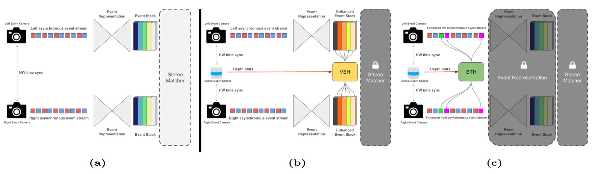
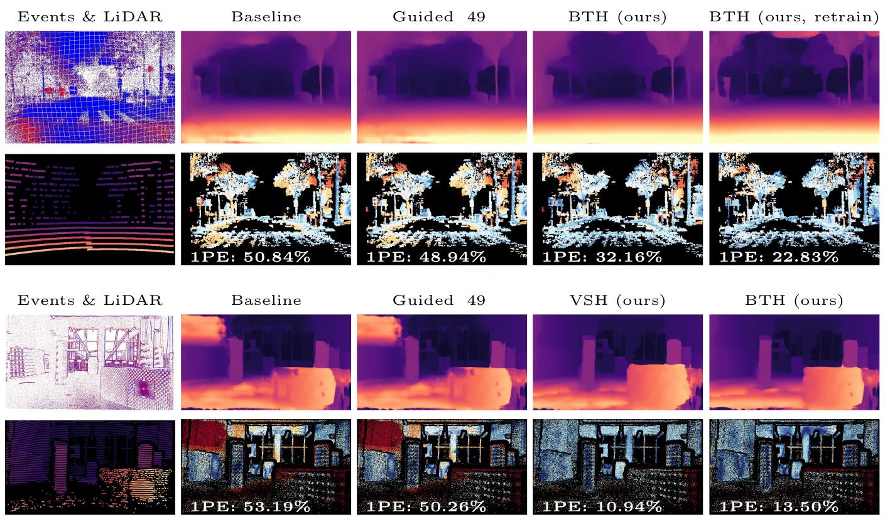
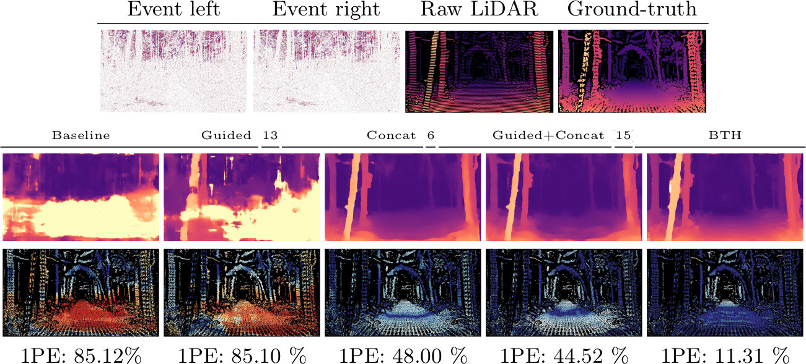
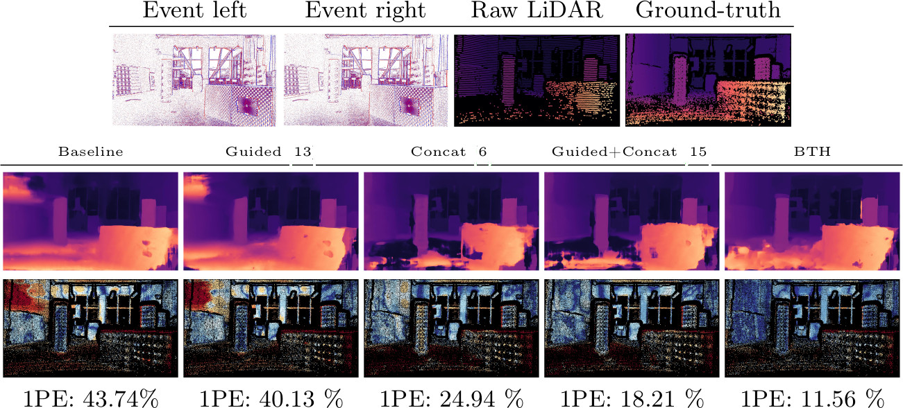

<h1 align="center"> LiDAR-Event Stereo Fusion with Hallucinations (ECCV 2024) </h1> 

<br>

:rotating_light: This repository contains download links to our code, and trained deep stereo models of our work  "**LiDAR-Event Stereo Fusion with Hallucinations**",  [ECCV 2024](https://eccv.ecva.net/)
 
by [Luca Bartolomei](https://bartn8.github.io/)<sup>1,2</sup>, [Matteo Poggi](https://mattpoggi.github.io/)<sup>2</sup>, [Andrea Conti](https://andreaconti.github.io/)<sup>2</sup>, and [Stefano Mattoccia](https://github.com/stefano-mattoccia)<sup>1,2</sup>

Advanced Research Center on Electronic System (ARCES)<sup>1</sup>
University of Bologna<sup>2</sup>

<div class="alert alert-info">

<h2 align="center"> 

 LiDAR-Event Stereo Fusion with Hallucinations (ECCV 2024)<br>

 [Project Page](https://eventvppstereo.github.io/) | [Paper](https://eventvppstereo.github.io/assets/paper.pdf) |  [Supplementary](https://eventvppstereo.github.io/assets/paper-supp.pdf)
</h2>

**Note**: 🚧 Kindly note that this repository is currently in the development phase. We are actively working to add and refine features and documentation. We apologize for any inconvenience caused by incomplete or missing elements and appreciate your patience as we work towards completion.

## :bookmark_tabs: Table of Contents

- [:bookmark\_tabs: Table of Contents](#bookmark_tabs-table-of-contents)
- [:clapper: Introduction](#clapper-introduction)
- [:inbox\_tray: Pretrained Models](#inbox_tray-pretrained-models)
- [:memo: Code](#memo-code)
  - [:hammer\_and\_wrench: Setup Instructions](#hammer_and_wrench-setup-instructions)
- [:floppy_disk: Datasets](#floppy_disk-datasets)
- [:rocket: Test](#rocket-test)
- [:art: Qualitative Results](#art-qualitative-results)
- [:envelope: Contacts](#envelope-contacts)
- [:pray: Acknowledgements](#pray-acknowledgements)

</div>

## :clapper: Introduction

This pioneering paper proposes a solution to the issues caused by the absence of motion or the presence of large untextured regions in an event-based stereo matching setup.

Given that event cameras provide rich cues at object boundaries and active sensors can measure depth where the lack of texture makes event cameras uninformative, we took inspiration from our previous work [Active Stereo Without Pattern Projector (ICCV 2023)](https://vppstereo.github.io/) to integrating a stereo event camera with an active sensor -- e.g., a LiDAR. 


Inserting fake events inside the event stacks of the event-stereo network (**VSH**) or even directly inside the event stereo stream (**BTH**), we managed to alleviate the aforementioned issues.



<p style="text-align: justify;"><strong>Overview of a generic event-based stereo network and our hallucination strategies.</strong> State-of-the-art event-stereo frameworks (a) pre-process raw events to obtain event stacks fed to a deep network. In case the stacks are accessible, we define the model as a gray box, otherwise as a black box. In the former case (b), we can hallucinate patterns directly on it (VSH). When dealing with a black box (c), we can hallucinate raw events that will be processed to obtain the stacks (BTH).</p>

**Contributions:** 

* We prove that LiDAR-stereo fusion frameworks can effectively be adapted
to the event stereo domain.

* Our VSH and BTH frameworks are general and work effectively with any
structured representation among the eight we surveyed.

* Our strategies outperform existing alternatives inherited from RGB stereo
literature on [DSEC](https://dsec.ifi.uzh.ch/) and [M3ED](https://m3ed.io/) datasets.

* VSH and BTH can exploit even outdated LiDAR data to increase the event stream distinctiveness and ease matching, preserving the microsecond resolution of event cameras and eliminating the need for synchronous processing dictated by the constant framerate of the depth sensor.


:fountain_pen: If you find this code useful in your research, please cite:

```bibtex
@inproceedings{bartolomei2024lidar,
  title={LiDAR-Event Stereo Fusion with Hallucinations},
  author={Bartolomei, Luca and Poggi, Matteo and Conti, Andrea and Mattoccia, Stefano},
  booktitle={European Conference on Computer Vision (ECCV)},
  year={2024},
}
```

## :inbox_tray: Pretrained Models

Here, you can download the weights of the baseline architecture trained on [DSEC](https://dsec.ifi.uzh.ch/) with eight different stacking representations.

To use these weights, please follow these steps:

1. Install [GDown](https://github.com/wkentaro/gdown) python package: `pip install gdown`
2. Download all weights from our drive : `gdown --folder https://drive.google.com/drive/folders/1wh2m2LB9DRmBCJ_scHy5Wbq6nstyxCg1?usp=sharing`

## :memo: Code

The **Test** section provides scripts to evaluate disparity estimation models on **DSEC** and **M3ED** datasets. It helps assess the accuracy of the models and saves predicted disparity maps.

Please refer to each section for detailed instructions on setup and execution.

<div class="alert alert-info">

**Warning**:
- Please be aware that we will not be releasing the training code for deep stereo models. The provided code focuses on evaluation and demonstration purposes only. 
- With the latest updates in PyTorch, slight variations in the quantitative results compared to the numbers reported in the paper may occur.

</div>


### :hammer_and_wrench: Setup Instructions

1. **Dependencies**: Ensure that you have installed all the necessary dependencies. The list of dependencies can be found in the `./requirements.txt` file.
2. **Build deform_conv**: 
    - Activate your virtual env
    - `cd ./src/components/models/baseline/deform_conv/`
    - `setup.py build_ext --inplace`


## :floppy_disk: Datasets
We used two datasets for training and evaluation.

### DSEC

Download [DSEC](https://dsec.ifi.uzh.ch/) (`train_events.zip` `train_disparity.zip` and `train_calibration.zip`) and extract them.

Next, you have to download in the same DSEC folder our preprocessed DSEC raw LiDAR scans:

```bash
cd PATH_TO_DSEC
gdown https://drive.google.com/file/d/1iYApCcGuk8RIL9aLchDDnvK4fe3qcTRk/view?usp=sharing
unzip dsec_raw.zip
```

After that, you will get a data structure as follows:

```
dsec
├── train
│   ├── interlaken_00_c
│   │   ├── calibration
│   │   │   ├── cam_to_cam.yaml
│   │   │   └── cam_to_lidar.yaml
│   │   ├── disparity
│   │   │   ├── event
│   │   │   │   ├── 000000.png
│   │   │   │   ├── ...
│   │   │   │   └── 000536.png
│   │   │   ├── raw
│   │   │   │   ├── 000000.png
│   │   │   │   ├── ...
│   │   │   │   └── 000268.png
│   │   │   ├── raw_mae.txt
│   │   │   ├── raw_mae.png
│   │   │   ├── raw_bad1.txt
│   │   │   └── timestamps.txt
│   │   └── events
│   │       ├── left
│   │       │   ├── events.h5
│   │       │   └── rectify_map.h5
│   │       └── right
│   │           ├── events.h5
│   │           └── rectify_map.h5
│   ├── ...
│   └── zurich_city_11_c                # same structure as train/interlaken_00_c
└── test
     └── ...
```

We managed to extract the raw LiDAR scans using only data from the [official website](https://dsec.ifi.uzh.ch/dsec-datasets/download/).
We used [FasterLIO](https://github.com/gaoxiang12/faster-lio) to de-skew raw LiDAR scans and [Open3D](https://github.com/isl-org/Open3D) to perform ICP registration.

The original [DSEC license](https://dsec.ifi.uzh.ch/#:~:text=3DV%29%7D%2C%0A%20%20year%20%3D%20%7B2021%7D%0A%7D-,License,-This%20dataset%20is) applies to the raw LiDAR files as well.

### M3ED

Download [M3ED](https://m3ed.io/) dataset using our modified script ([original script](https://raw.githubusercontent.com/daniilidis-group/m3ed/main/tools/download_m3ed.py)):

```bash
python src/download_m3ed_val.py --to_download data depth_gt --output_dir PATH_TO_M3ED_H5_FILES
```

After that, you will get a data structure as follows:

```
m3ed_h5
├── car_forest_tree_tunnel
│   ├── car_forest_tree_tunnel_data.h5
|   └── car_forest_tree_tunnel_depth_gt.h5
...
```

Convert H5 files using our preprocessing script:

```bash
python src/m3ed_converter.py -i PATH_TO_M3ED_H5_FILES -o PATH_TO_M3ED --max_offset_us 100000
```

After the conversion, you will get a data structure as follows:

```
m3ed
├── car_forest_tree_tunnel
│   ├── calibration
│   ├── disparity
|   └── events
...
```

The script emulates the data structure of DSEC. 
However, it additionally adds groundtruth and raw scans with different time offsets to replicate experiments in figure 8 and 9.
Check the `disparity` folders and look for `event_raw_{i}` with `i=2899,13321,32504,61207,100000`.

We managed to extract raw LiDAR using only data from the [official website](https://github.com/daniilidis-group/m3ed).

## :rocket: Test

This code snippet allows you to evaluate the disparity maps on [DSEC](https://dsec.ifi.uzh.ch/) and [M3ED](https://m3ed.io/) datasets. By executing the provided script, you can assess the accuracy of disparity estimation models on these datasets.

We provide six bash script to evaluate results of table 1,2,3,4 and figure 8,9.

To run an evaluation script, follow the istructions below:

1. **Run the test**:
   - Open a terminal or command prompt.
   - Navigate to the directory containing this repository.
   - Enable your virtual env with the required libraries.

2. **Execute the command**:
   Each script has parameters that you should set: 1) environment settings: set the path to your virtualenv/conda; 2) set `DATA_PATH` variable to the dataset path; 3) set `WEIGHTS_PATH` variable to the path where you downloaded our pretrained checkpoints.

   After that you can launch an evaluation script (for example Tab. 1 evaluation script):

   ```bash
    ./scripts/evaluate_table_1.sh
   ```

For more details about available arguments, please refer to the `inference.py` script.

## :art: Qualitative Results

In this section, we present illustrative examples that demonstrate the effectiveness of our proposal.

<br>

<p float="left">
  
</p>
 
**Performance against competitors -- pre-trained models.** On DSEC (top), BTH dramatically improves results over the baseline and Guided, yet cannot fully recover some details in the scene except when retraining the stereo backbone. On M3ED (bottom), both VSH and BTH with pre-trained models reduce the error by 5×.
 
<br>

<p float="left">
  
</p>

**Performance against competitors -- refined models (outdoor).** [Concat](https://github.com/XuelianCheng/LidarStereoNet) and [Guided+Concat](https://github.com/zswang666/Stereo-LiDAR-CCVNorm) can reduce the error by about 40%, yet far behind the improvement yielded by BTH (more than 70% error rate reduction).

<br>

<p float="left">
  
</p>

**Performance against competitors -- refined models (indoor).** our proposal confirms again the best solution for exploiting raw LiDAR measurements and improve the accuracy of event-based stereo networks.

## :envelope: Contacts

For questions, please send an email to luca.bartolomei5@unibo.it

## :pray: Acknowledgements

We would like to extend our sincere appreciation to the authors of the following projects for making their code available, which we have utilized in our work:

- We would like to thank the authors of [SE-CFF](https://github.com/yonseivnl/se-cff) for providing their code, which has been instrumental in our stereo matching experiments.

<h5 align="center">Patent pending - University of Bologna</h5>
